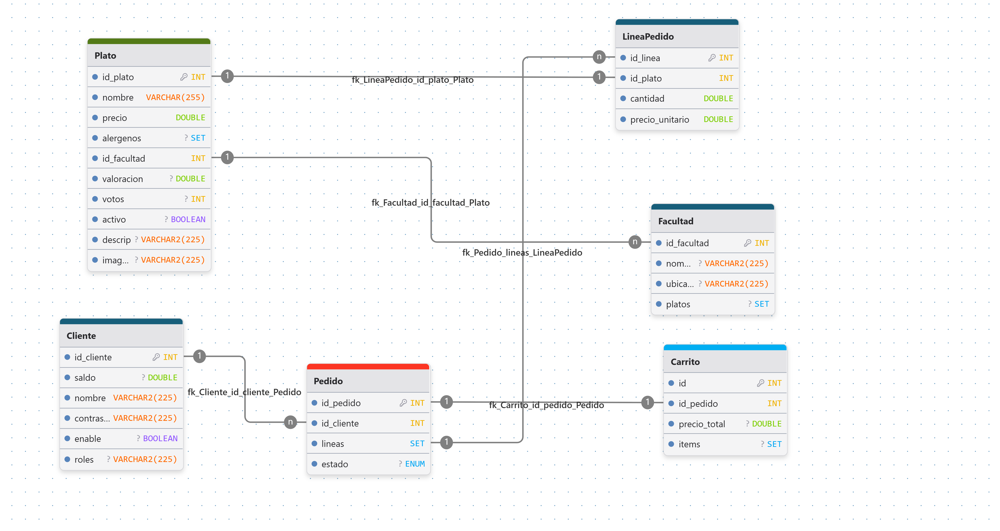

# MenUni - Menús Universitarios UCM

## Descripción del Proyecto
**MenUni** es una aplicación web diseñada para la comunidad universitaria de la Universidad Complutense de Madrid (UCM). El objetivo principal es permitir a los usuarios consultar y realizar pedidos de los diferentes platos que ofrecen las cafeterías de las distintas facultades de la universidad y asi ahorrar mucho tiempo pudiendo pedir los platos en la facultad que necesites y justo antes de que se acaben las clases.

El sistema cuenta con varios roles de usuario:
* **Usuario/Cliente:** Dispone de un monedero o saldo virtual. Puede ver los platos disponibles, añadirlos a su carrito y comprarlos siempre y cuando disponga de saldo suficiente.
* **Administrador / Gestor:** Tiene acceso a un panel de control dedicado (vista de gestor) desde el cual puede administrar el catálogo de comida. Puede insertar nuevos platos al menú o eliminar aquellos que ya no estén disponibles.

## Estructura de la Base de Datos

## Estado de Implementación de las Vistas

A continuación se detalla el estado actual de las vistas del proyecto:

* **Login (`login.html`)**: **[Completada]** Permite el inicio de sesión seguro y redirige al usuario o al administrador a sus respectivas vistas según su rol.
* **Inicio (`inicio.html`) y Facultades (`facultades.html`)**: **[Completada]** Muestra el listado de las diferentes facultades de la UCM viendo cuales hay disponibles. Mientras que en la vista de inicio se muestra una descripcion de la pagina web, unos consejos interactivos saludables y por último los integrantes del equipo de desarrollo.
* **Plato (`plato.html`) y Carrito (`carrito.html`)**: **[En un estado avanzado]** Permite visualizar los detalles de un plato, agregarlo al carrito y procesar el pedido descontando el importe del saldo del usuario.
* **Panel de Gestor/Admin (`gestor.html` / `admin.html`)**: **[Implementada]** Vista reservada para usuarios con rol de administrador. Permite la gestión del catálogo de productos (creación y eliminación de platos) y el control de los mensajes que otros usuarios mandan.
* **Perfil de Usuario (`user.html`)**: **[Completada]** Muestra la información personal del usuario y su saldo actual disponible para realizar compras.
* **Otras vistas (`ranking.html`, `contacto.html`)**: **[Completada]** Vista de ranking para ver los platos con mejores valoraciones o para ordenarlos por orden alfabético y la vista de contacto donde se puede enviar un mensaje como usuario al admin de la web sobre algún problema o alguna duda rellenando los campos de asunto y descripción.